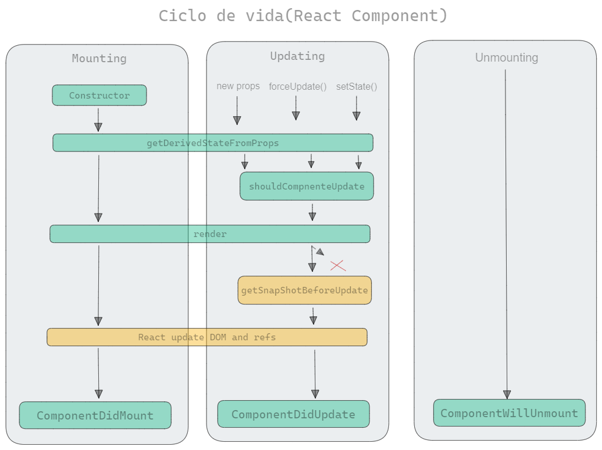

# Ciclo de vida(Componente)

## <mark style="color:blue;">Ciclo de Vida</mark>

***

&#x20;        **Os ciclos de vida têm o objetivo de destruir componentes que não estão sendo utilizados. Dessa forma, podemos garantir que os recursos serão alocados somente nos componentes em uso. Por essa razão, cada componente possui um ciclo de vida, que vai da fase de montagem até a fase de desmontagem (destruição). E, cada fase possui métodos, que são as funções de ciclos de vida.**      &#x20;

### <mark style="color:blue;">Exemplo:</mark>

***

<figure><figcaption></figcaption></figure>

***

### <mark style="color:blue;">O Ciclo de vida possui três fazes</mark>

1. **Montagem**
2. **Atualização**
3. **Desmontagem**

### <mark style="color:blue;">Montagem</mark>

***

&#x20;    **A montagem é o “nascimento” ou a inicialização do componente. Nesse momento, o componente será montado na DOM. É nessa fase que o componente recebe dados passados pelo componente pai, oficialmente conhecido como `“props”`. Além disso, é a etapa reservada para  realização de chamadas `HTTP` para `APIs`, configuração do estado do componente e validação das `props`.**

* **`constructor`**

&#x20;      **é a primeira coisa a ser montada no componente. Dentro dela podemos usar a função `bind` para fazer a correção de escopo no nosso projeto, fazendo com que o `this` aponte para o contexto correto. Podemos também criar estados, chamar a função `super` e herdar funções do `Component`.**

* **render**

&#x20;     **Ela é responsável por fazer a montagem do componente, sendo o intermediário entre a parte da montagem e a atualização/desmontagem de um componente.**

* **`componentDidMount`**

&#x20;      Esta função é executada logo após a montagem do componente na DOM. Ou seja, após a função render. Dentro dessa função, podemos realizar chamadas a API, inicializar alguma espécie de contador, além de outras coisas que devem ser executadas de forma primária.

### <mark style="color:blue;">Atualização</mark>

***

&#x20;        **Essa etapa acontece depois da montagem do componente na `DOM` e vai adicionando ou removendo elementos a medida que o componente for recebendo algum tipo de atualização, seja através das `props` ou do `estado`.**

* **`shouldComponentUpdate`**

&#x20;        Essa função será invocada caso haja alguma modificação no componente, seja nas `props` ou no estado. Nela podemos definir se o componente será renderizado novamente ou não. Por padrão, o componente irá renderizar novamente caso haja alguma alteração.&#x20;

* **`render`**

&#x20;      **O render também faz parte da etapa de atualização, pois toda vez que um componente recebe alguma modificação, o render é o responsável direto por montá-lo novamente.**

* **`componentDidUpdate`**

&#x20;       **Ele é chamado logo após do `componentDidMount`, sendo excelente para checar se ocorreu alguma mudança logo de cara no estado da aplicação. Ou seja, se uma chamada a API faz alguma mudança no nosso estado, por exemplo.**

### <mark style="color:blue;">Desmontagem</mark>

***

**Nesta seção, o componente já não é necessário e precisa se desmontado.**

* **`componenteWillUnmount`**

&#x20;      **Essa função é chamada quando o componente some da tela, impedindo que ele fique montado. Finalmente ele será “destruído”. Normalmente, é usada para alguma operação assíncrona inicializada na função `componentDidMount`; como, por exemplo, remover alguma inscrição de algum evento, cancelar alguma requisição HTTP, invalidar algum timer, etc.**
